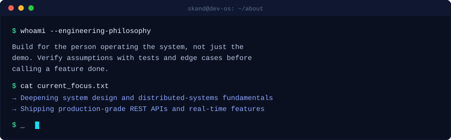
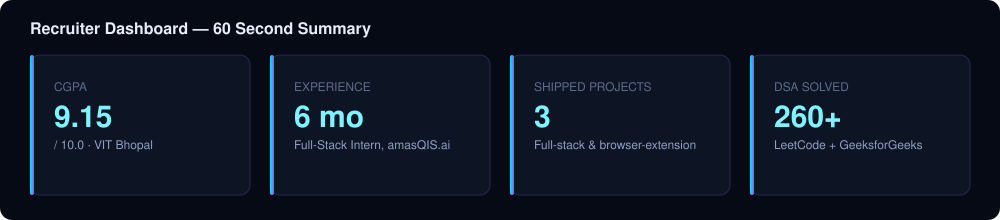
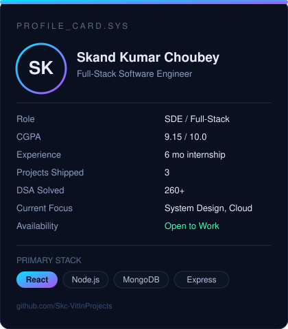
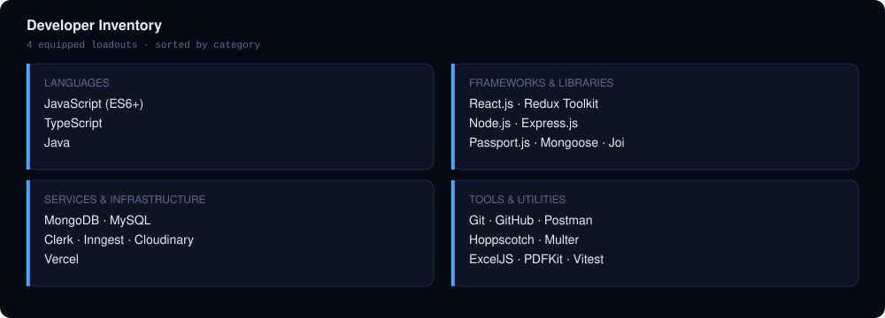
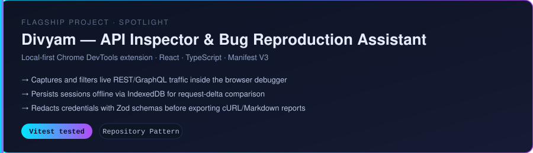
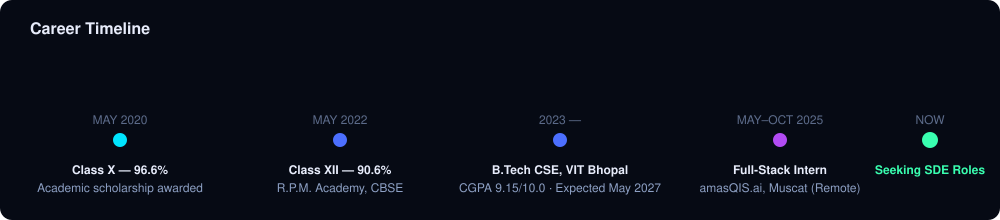
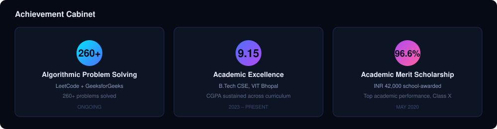
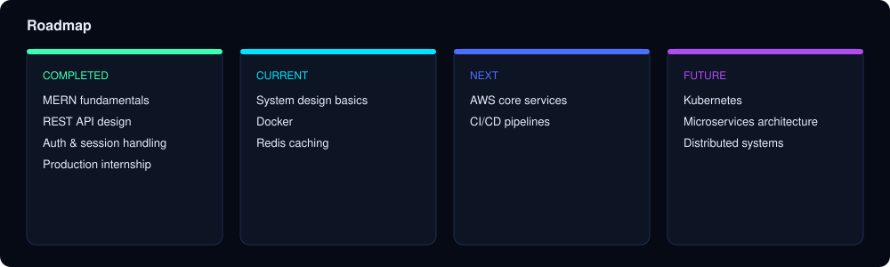

<div align="center">


<br/>

[](https://git.io/typing-svg)

<br/>

<a href="#about">About</a> ·
<a href="#recruiter-dashboard">Dashboard</a> ·
<a href="#developer-inventory">Stack</a> ·
<a href="#featured-projects">Projects</a> ·
<a href="#professional xperience">Experience</a> ·
<a href="#achievement-cabinet">Achievements</a> ·
<a href="#github-statistics">Stats</a> ·
<a href="#roadmap">Roadmap</a> ·
<a href="#contact">Contact</a>

<br/><br/>


[](https://www.linkedin.com/in/Skandkc)
[](https://leetcode.com/u/iskc9838/)
[](mailto:iskc9838@gmail.com)

</div>
<br/>

<h2 id="about">About</h2>


<table>
<tr>
<td valign="top" width="50%">

```yaml
developer_profile:
  name: Skand Kumar Choubey
  role: Full-Stack Software Engineer
  degree: B.Tech, Computer Science Engineering
  university: VIT Bhopal (Expected May 2027)
  cgpa: 9.15 / 10.0

mission: >
  Ship reliable, well-architected products —
  from REST APIs to the interfaces that consume them —
  and get progressively better at systems that scale
  beyond a single machine.

current_focus:
  - System design fundamentals
  - Backend performance & caching (Redis)
  - Cloud infrastructure (AWS)

engineering_philosophy: >
  Correctness and clarity before cleverness.
  Every endpoint should handle its edge cases,
  not just its happy path.

specializations:
  - REST API architecture
  - Real-time systems (SSE, event-driven jobs)
  - MERN-stack product engineering
  - Data structures & algorithms
```

</td>
<td valign="top" width="50%">



</td>
</tr>
</table>

<br/>

<h2 id="recruiter-dashboard">Recruiter Dashboard</h2>


<p align="center"></p>

<div align="center">

</div>
  
<br/>

<h2 id="developer-inventory">Developer Inventory</h2>


<p align="center"></p>

<p align="center"></p>
  
<br/>

<h2 id="featured-projects">Featured Projects</h2>


<p align="center"></p>

<br/>

### Mission 01 — HangOut · Full-Stack Social Media Platform

**Stack:** React.js · Node.js · Express.js · MongoDB · Redux Toolkit · Clerk · Inngest · Multer · ImageKit CDN
**Repository:** [github.com/Skc-VitInProjects/HangOut](https://github.com/Skc-VitInProjects/HangOut)
**Live Demo:** Not publicly deployed — runnable locally from the repository

| | |
|---|---|
| **Overview** | A MERN-stack social platform with chronological activity feeds, connection management, and ephemeral 24-hour stories governed by custom privacy permissions. |
| **Architecture** | React + Redux Toolkit client talking to an Express/MongoDB API; authentication delegated to Clerk; background jobs (story expiration, scheduled email retries) handled by Inngest workers decoupled from the request/response cycle. |
| **Engineering Decisions** | Chose **Server-Sent Events** over WebSockets for real-time messaging — the app only needed server-to-client push, so SSE avoided the handshake and connection-management overhead of a full-duplex protocol. An in-memory connection registry tracks active listeners per user. |
| **Challenges** | Coordinating ephemeral content (24-hour stories) with asynchronous cleanup without blocking the request path — solved by moving expiration into scheduled Inngest functions instead of cron-polling the database. |
| **Features** | Activity feeds · real-time connection requests · 24-hour stories with privacy scoping · media uploads via Multer + ImageKit |
| **Lessons Learned** | SSE is a strong default for one-directional real-time updates — bidirectional protocols carry cost that isn't always justified by the use case. |

<br/>

### Mission 02 — Divyam · API Inspector & Bug Reproduction Assistant

**Stack:** React · TypeScript · Manifest V3 · IndexedDB · Zod · Vitest
**Repository:** [github.com/Skc-VitInProjects/Divyam](https://github.com/Skc-VitInProjects/Divyam)
**Live Demo:** Chrome DevTools extension — load unpacked from the repository

| | |
|---|---|
| **Overview** | A local-first Chrome DevTools extension that captures, filters, and inspects live REST/GraphQL network traffic directly inside browser debugging workflows. |
| **Architecture** | Manifest V3 service-worker architecture with a React-based DevTools panel; a modular Repository pattern isolates persistence (IndexedDB) from capture and export logic, backed by automated Vitest suites. |
| **Engineering Decisions** | Built offline-first with **IndexedDB** session persistence so developers can save, replay, and diff failing vs. successful API payloads across sessions without a backend dependency. |
| **Challenges** | Safely exporting captured requests as cURL/Markdown without leaking credentials — addressed with **Zod**-schema-driven redaction applied before any export is generated. |
| **Features** | Live REST/GraphQL traffic capture · request delta comparison · credential-redacted cURL/Markdown export · offline session storage |
| **Lessons Learned** | Designing the redaction schema before the export format kept sensitive data out of every downstream artifact by construction, rather than by after-the-fact filtering. |

<br/>

### Mission 03 — ConfirmStay · Accommodation Listing & Review Platform

**Stack:** Node.js · Express.js · MongoDB · Mongoose · Passport.js · Cloudinary · Joi
**Repository:** [github.com/Skc-VitInProjects/ConfirmStay](https://github.com/Skc-VitInProjects/ConfirmStay)
**Live Demo:** Not deployed — a learning-stage MVC build without a booking flow or production users

| | |
|---|---|
| **Overview** | A full-stack accommodation marketplace built on the MVC pattern, supporting dynamic listing management and user reviews. |
| **Architecture** | Express + EJS server-rendered views, MongoDB via Mongoose, session-based auth through Passport.js, media handled through Cloudinary. |
| **Engineering Decisions** | Enforced **resource-level authorization** on top of authentication — every mutation checks listing ownership server-side, not just whether a user is logged in. |
| **Challenges** | Preventing orphaned reviews when a listing is deleted — solved with Mongoose middleware hooks that cascade cleanup automatically on delete. |
| **Features** | Listing CRUD · review system · Joi-validated input schemas · ownership-scoped authorization |
| **Lessons Learned** | Validation and authorization belong at the schema and middleware layer, not scattered across route handlers — it made the codebase far easier to audit. |

  
<br/>

<h2 id="professional xperience">Professional Experience</h2>


<p align="center"></p>

<table>
<tr>
<td width="70%">

**Full-Stack Development Intern** — [Certificate](https://drive.google.com/file/d/10zEjWczcLjuzLXwwJ9IIHXZPsbWHuMPN/view?usp=sharing)
*amasQIS.ai* · [GitHub](https://github.com/Skc-VitInProjects/HRMS) · Muscat, Oman (Remote)

</td>
<td width="30%" align="right">

**May 2025 – October 2025**

</td>
</tr>
</table>

**Responsibilities & Impact**

- Engineered RESTful APIs for the Employee Profile, Recruitment, and CRM modules using Node.js, Express.js, and MongoDB, supporting interactive React.js interfaces for **1,000+ active users**.
- Optimized Mongoose aggregation pipelines in the Subscription module, eliminating hardcoded fallbacks to keep backend state synchronized in real time with low-latency dynamic queries.
- Implemented automated document-generation workers using **ExcelJS** and **PDFKit**, streaming structured HR data exports and cutting administrative report processing time.
- Conducted API integration testing and schema verification with Postman and Hoppscotch, ensuring edge-case error handling and reliable backend-to-frontend payload delivery.

**Technologies:** `Node.js` `Express.js` `MongoDB` `Mongoose` `React.js` `ExcelJS` `PDFKit` `Postman` `Hoppscotch`
  
<br/>

<h2 id="achievement-cabinet">Achievement Cabinet</h2>


<p align="center"></p>
  
<br/>

<h2 id="github-statistics">GitHub Statistics</h2>


<div align="center">


<br/>


<br/><br/>


<br/><br/>


</div>

> Generated by [github-readme-stats](https://github.com/anuraghazra/github-readme-stats), [streak-stats](https://github.com/DenverCoder1/github-readme-streak-stats), and the [contribution snake workflow](../.github/workflows/snake.yml) — all render live from `Skc-VitInProjects`'s real activity, no static numbers.
  
<br/>

<h2 id="roadmap">Roadmap</h2>


<p align="center"></p>
  
<br/>

<h2 id="current-learning">Current Learning</h2>


| Topic | Status | Progress |
|---|---|---|
| System Design | Developing |  |
| Docker | Developing |  |
| Redis | Exploring |  |
| AWS | Exploring |  |
| Kubernetes | Early |  |
| Microservices | Early |  |

Progress reflects working familiarity, not certification — these are the areas actively being built into hands-on projects next.
  
<br/>

<h2 id="coding-profiles">Coding Profiles</h2>


<div align="center">

| Platform | Handle | Purpose |
|---|---|---|
| [](https://github.com/Skc-VitInProjects) | `Skc-VitInProjects` | Source code, project history, activity graph |
| [](https://leetcode.com/u/iskc9838/) | `iskc9838` | DSA practice and contest problems |
| [](https://www.geeksforgeeks.org/profile/iskc91yky) | `iskc91yky` | Additional DSA problem-solving |
| [](https://www.linkedin.com/in/Skandkc) | `Skandkc` | Professional network, career updates |

</div>
  
<br/>

<h2 id="open-source">Open Source</h2>


**Current Contributions**
Primary open work today lives in personal repositories — [HangOut](https://github.com/Skc-VitInProjects/HangOut), [Divyam](https://github.com/Skc-VitInProjects/Divyam), and [ConfirmStay](https://github.com/Skc-VitInProjects/ConfirmStay) — all public and open to issues or pull requests.

**Contribution Philosophy**
Prefer contributing to projects actually used first, so feedback and fixes come from real usage rather than a search for "good first issues."

**Future Goals**
- First external pull request merged into a MERN or DevTools-adjacent open-source project
- Participate in Hacktoberfest with meaningful, non-trivial contributions
- Publish a small utility package (extracted from Divyam's redaction/export logic) for reuse
  
<br/>

<h2 id="contact">Contact</h2>


<div align="center">

[](mailto:iskc9838@gmail.com)
[](https://www.linkedin.com/in/Skandkc)
[](https://github.com/Skc-VitInProjects)

Open to Software Development Engineer and Full-Stack Developer roles — available to start immediately.

</div>
  

<div align="center">


<sub>Built with hand-authored SVG, no template generators. © 2026 Skand Kumar Choubey.</sub>
</div>
