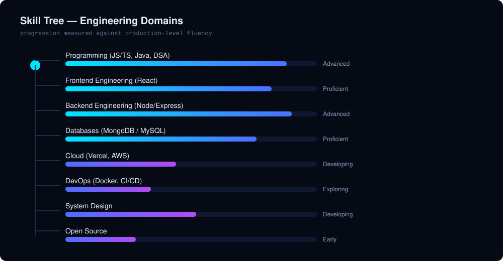

<!-- ========================================================= -->
<!--                  GITHUB PROFILE README                    -->
<!-- ========================================================= -->

<div align="center">

# ⚡ INITIALIZING DEVELOPER PROFILE...

```text
████████████████████████████████████ 100%

Loading Character Data...
Loading Achievements...
Loading Projects...
Loading GitHub Statistics...
Loading Developer Skill Tree...

WELCOME, RECRUITER.
```



# 👋 Hi, I'm Skand Kumar Choubey

### Full Stack Engineer • Backend Developer • MERN Stack • Problem Solver


<br>


</div>

---

# 🎮 PLAYER PROFILE

```yaml
Name:        Skand Kumar Choubey

Class:       Software Engineer

Guild:       VIT Bhopal

Current Rank: Full Stack Developer

Level:       21

XP:          ██████████████████░ 91%

Health:      ███████████████████

Mana:        ███████████████████

Primary Weapon:
  JavaScript ⚔

Secondary Weapon:
  Java ☕

Current Quest:
  Crack Top Software Engineering Roles

Status:
  ONLINE 🟢
```

---

# 🧭 RECRUITER DASHBOARD

| ✔ | Status |
|------|--------|
| 🎓 B.Tech CSE @ VIT Bhopal | Completed |
| ⭐ CGPA 9.15 | Excellent |
| 💼 Full Stack Internship | Completed |
| 🚀 Production APIs | Yes |
| 👨‍💻 MERN Developer | Yes |
| 📦 Chrome Extension Developer | Yes |
| 📈 260+ DSA Problems | Yes |
| 🌍 Open to Opportunities | Yes |

---

# ⚔️ CHARACTER STATS

| Attribute | Progress |
|------------|----------|
| Backend Development | ███████████████░ 92% |
| Frontend Development | ████████████░░░ 83% |
| REST API Design | ███████████████ 95% |
| MongoDB | █████████████░░ 82% |
| JavaScript | ███████████████ 95% |
| Java | █████████████░░ 88% |
| Data Structures | ████████████░░░ 84% |
| System Design | ████████░░░░░░░ 58% |
| DevOps | ██████░░░░░░░░░ 45% |

---

# 🎯 MAIN QUEST

```diff
+ Build Production Grade Software

+ Build Developer Tools

+ Master Backend Engineering

+ Reach 500 DSA Problems

+ Learn Docker

+ Learn Kubernetes

+ Learn AWS

+ Become an Excellent Software Engineer
```

---

# 🛡 INVENTORY

| Category | Equipped |
|-----------|-----------|
| ⚔ Languages | JavaScript • Java |
| 🛡 Frontend | React • HTML • CSS • Bootstrap |
| ⚙ Backend | Node.js • Express.js |
| 🗄 Database | MongoDB • MySQL |
| 🧰 Tools | Git • GitHub • Postman • Hoppscotch |
| ☁ Cloud | Vercel • Cloudinary |
| 🔥 Others | Clerk • Inngest • Multer |

---

# 🌳 DEVELOPER SKILL TREE

> *(Detailed RPG skill tree will appear in the next file.)*



---

# 🚀 FEATURED QUESTS

## 🟣 Divyam

Legendary Developer Tool

> API Inspector & Bug Reproduction Assistant

```
★★★★★

+ React

+ TypeScript

+ Manifest V3

+ IndexedDB

+ Zod

+ Vitest
```

---

## 🔵 HangOut

Epic Full Stack Project

```
★★★★★

+ React

+ Node

+ MongoDB

+ SSE

+ Clerk

+ Inngest
```

---

## 🟢 ConfirmStay

Rare Full Stack Project

```
★★★★☆

+ Node.js

+ MongoDB

+ Passport

+ Cloudinary

+ MVC
```

---

# 📊 GITHUB ANALYTICS

<div align="center">


</div>

---

<div align="center">


</div>

---

<div align="center">


</div>

---

# 🏆 ACHIEVEMENTS

🏅 9.15 CGPA

🏅 Full Stack Internship

🏅 1000+ Enterprise Users

🏅 260+ DSA Problems

🏅 ₹42,000 Merit Scholarship

🏅 Chrome DevTools Extension

---

# 🌍 CONNECT

<p align="center">

<a href="mailto:iskc9838@gmail.com">

</a>

<a href="https://linkedin.com/in/Skandkc">

</a>

<a href="https://github.com/Skc-VitInProjects">

</a>

<a href="https://leetcode.com/u/iskc9838">

</a>

<a href="https://www.geeksforgeeks.org/profile/iskc91yky">

</a>

</p>

---

<div align="center">

## 🎮 GAME PROGRESS

```
Main Story

███████████████░░░░ 72%

Side Quests

████████████████░░░ 80%

Open Source

███░░░░░░░░░░░░░░░░ 18%

Learning

██████████████████░ 93%
```

---

### ⭐ "Code. Learn. Build. Repeat."


</div>
